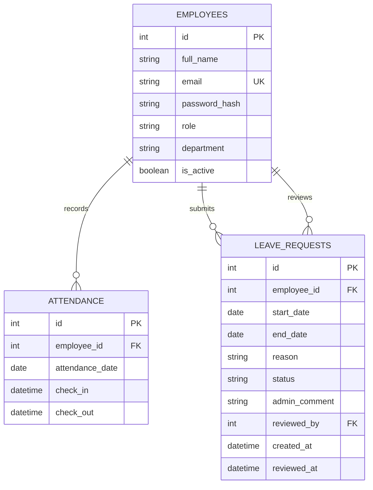

# ERD

```mermaid
erDiagram
  EMPLOYEES ||--o{ ATTENDANCE : records
  EMPLOYEES ||--o{ LEAVE_REQUESTS : submits
  EMPLOYEES ||--o{ LEAVE_REQUESTS : reviews
  EMPLOYEES {
    int id PK
    string full_name
    string email UK
    string password_hash
    string role
    string department
    boolean is_active
  }
  ATTENDANCE {
    int id PK
    int employee_id FK
    date attendance_date
    datetime check_in
    datetime check_out
  }
  LEAVE_REQUESTS {
    int id PK
    int employee_id FK
    date start_date
    date end_date
    string reason
    string status
    string admin_comment
    int reviewed_by FK
    datetime created_at
    datetime reviewed_at
  }
```
